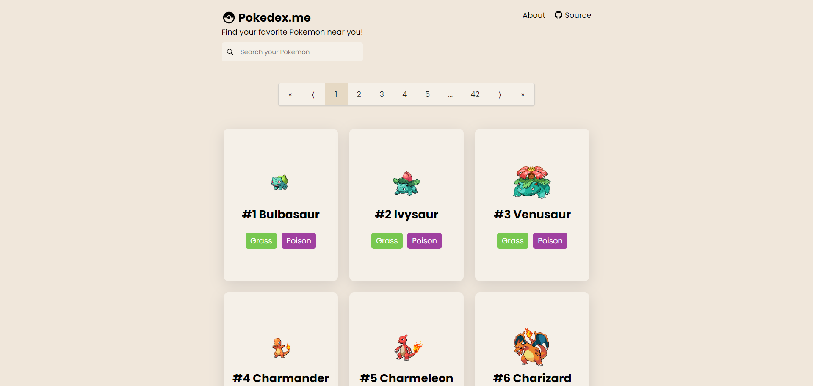

A react app based in the public <a href="https://pokeapi.co/">PokeAPI</a>.

 
  

## Preview

 

 

## Techs and Libs 🧪

This project was developed with the following technologies and libraries:

- [React](https://reactjs.org)
- [PokeAPI](https://pokeapi.co/)
- [React Router](https://reactrouter.com/)
- [Sass](https://sass-lang.com/)
- [Axios](https://axios-http.com/docs/intro)
- [React Leaflet](https://react-leaflet.js.org/)
- [React Semantic UI](https://react.semantic-ui.com/)
- [React Icons](https://react-icons.github.io/react-icons/)
- [React Spinners](https://www.davidhu.io/react-spinners/)

---

## Project 💻

Pokedex.me is a application list pokemons and show their stats, sounds and more. You can also simulate a Pokemon appearance in a interactive map.

---

## License

[MIT License](./LICENSE.md)

---

Feito com ⭐ by Davi Alcântara.
